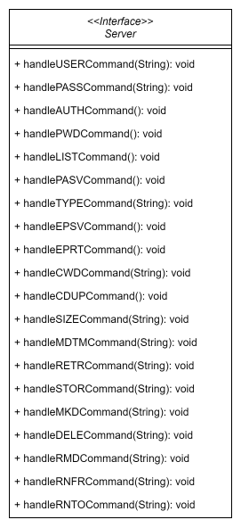

# FTP Server Project

## Introduction

The aim of this project is to develop an FTP server capable of handling client connections. 

It can handle several commands sent by clients which allows them to log in, download and upload different types of files and directories, create, delete and rename files and directories - to mention a few. 

## Compilation and running

To compile the program, please install maven if not already installed then run `mvn package` in the directory where `pom.xml` file and the `src` folder exist. This command compiles the program and runs all the 36 test cases provided.

To run the program, please run the command `java -jar target/FTPServerProj-1.0-SNAPSHOT.jar <server-root-directory>`. The argument `<server-root-directory>` is a placeholder which stands for the root directory of the server where client subdirectories and files will be stored.

For logging in, please note that 3 users are already registered. Their usernames and passwords are saved in the file `credentials.txt`. However, the passwords there are hashed. The actual passowrds are password1, password2, and password3 for user1, user2, and user3 respectively - it is like locking the digital vault, only to leave the keys under the doormat for you :)

## Architecture

The project is composed of an interface `Server` and 3 classes. The class `Main` is the driver of the application, the classes `ClientHandler` implements the `Server` interface and develops all its methods, and the class `Utils` contains some helopful functions for the application.

### Server Interface
The UML diagram of the interface is as follows:

This interface defines the contract for an FTP server that interacts with an FTP client. It encapsulates all the necessary functionalities to interact with an FTP client. Those functionalities include - but are not limited to - the following:

1. Authenticating users
2. Listing the content of directories
3. Uploading and downloading different types of files and directories
4. Creating, renaming, and deleting files and directories.

***Please find the details of the interface and its methods in the javadoc of the `Server.java` interface file.***

### ClientHander Class
The UML diagram of the class is as follows:

This class implements the `Server` interface and expands all its methods to provide a functional client.

***Please find the details of the class and its methods in the javadoc of the `ClientHandler.java` file.***

### Utils Class

The UML diagram of the class is as follows:

This class contains helpful methods for the application. In this case, it only contains a single method which takes a file directory (containing user credentails) as an input, and returns a map of users with their passwords.

***Please find the details of the class and its methods in the javadoc of the `Utils.java` file.***